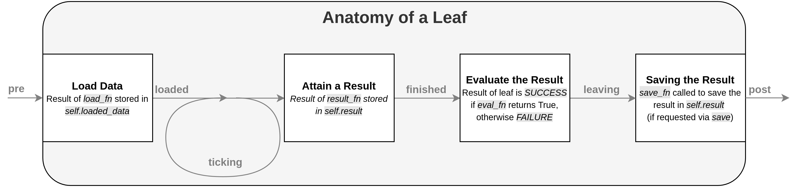

# RV Trees Package

RV Trees contains custom implementations & extensions of the behaviour trees defined in [py_trees](https://py-trees.readthedocs.io/en/devel/). This package gives us all of the ground-level features & functionality needed to use behaviour trees extensively in our research projects. The classes in this package are a base to help build behaviour trees for solving tasks, but in general should not be expanded or changed. See [the README of rv_tasks](https://bitbucket.org/acrv/rv_tasks/src/master/) for full details & an example of how to get a robot solving a task using trees.

The main contribution of this package is a structured, consistent, and flexible definition for the internals of a leaf. By defining this here, we have a common base that "automagically" handles a large majority of the challenges in passing data & linking components in a behaviour tree.

## The Anatomy of a Leaf



The above figure shows the anatomy of leaf's lifecycle, from the time it is started by the behaviour tree to the time it finishes & the tree moves onto the next leaf. Details for each of the parts in the image above are provided below:

- **pre**: other leaves have run before this leaf & stored data in the [py_trees blackboard](https://py-trees.readthedocs.io/en/devel/blackboards.html) (a centralised key-value dictionary). There is also the special method `get_last_value()` from `rv_trees.data_management` that will "magically" get the last saved result from a previous leaf. 
- **load data**: the leaf will attempt to load any data it needs by calling `load_fn`. If the `load_fn` argument is not provided, there is a default behaviour that should work for most cases. The default `load_fn` (see `Leaf._default_load_fn()`) will load from the blackboard key `load_key` if provided, otherwise it uses the last saved value through `get_last_value()`.
- **loaded**: the result of `load_fn` can be assumed to be available in the `self.loaded_data` member from this point forward.
- **ticking**: advanced behaviour for a leaf that doesn't complete immediately. Override `is_leaf_done()` to control how the leaf decides its action is done, & override `_extra_update()` to start your long running behaviour. It **must not** be blocking!
- **attain a result**: after the leaf is done it calls `result_fn` to get the result of the action performed (for short running actions you can simply perform it in `result_fn`). 
- **finished**: the leaf has performed its action, it can be assumed that the result is available in `self.result`.
- **saving the result**: if the `save` flag is set, the leaf will attempt to save `self.result` (or `save_value`) according to `save_fn`. The default `save_fn` should be fine for most cases; it saves the result to key `save_key` if it is set, otherwise the result is saved such that it is available to the next leaf in the tree with `get_last_value()`.
- **leaving**: the leaf is done; no more actions should be performed by the leaf from this point on.
- **evaluate the result**: `eval_fn` is called to determine whether the leaf's process was a success or failure. The function is provided with `save_value` if set, otherwise `self.result`. If no `eval_fn` is provided, the default will return the first bool if the data provided is a list, otherwise the Boolean evaluation of the data.
- **post**: the tree has decided the leaf is done; any steps your leaf needs to perform to stop its action should be done in an overload of `_extra_terminate()`. For example, an `ActionLeaf` sends the pre-empt signal by overloading `extra_terminate()`.

That's a general overview of the leaf lifecycle in `rv_trees`. We have covered what you will need to know about leaves for 99% of cases, but there are also other methods you can override to control other parts of the process. See the class implementation `rv_trees.leaves.Leaf` for full details.

## Using Leaves with ROS

All the work for interfacing with ROS topics, Services, & Action Servers is already done for you in `rv_trees.leaves_ros.*`. It provides the following leaves (that extend the functionality of the base `Leaf` class described above):

- `ActionLeaf`: calls a ROS Action Server with namespace `action_namespace`
- `PublisherLeaf`: publishes a message on topic `topic_name` with type `topic_class`
- `ServiceLeaf`: calls a ROS Service with service name `service_name`
- `SubscriberLeaf`: receives a message on topic `topic_name` with type `topic_class`

ROS can be a bit torturous when it comes to passing data between processes. For example, a service response `MyServiceResponse` with fields `PoseStamped` & an Action Server with goal `MyActionGoal` with exactly the same fields, they cannot be used interchangeably. A manual conversion for every possible type of input data is needed even though they have exactly the same fields. This becomes extremely tedious in the scope of a tree, especially given a leaf should be written so that it is as input agnostic as possible!

`rv_trees` handles this pain "automagically" through the method `rv_trees.data_management.auto_generate()`. This function tries as hard as possible to generate an instance of the desired object class from input data (don't ask...). While being extremely convenient (it stops you from having to write all this annoying arbitrary linking code), it is also crucial to your leaves. Using this method means your leaves will work with as many different types of input as possible, rather than only working if preceded by some specific leaf that outputs some specific class providing the only supported input.

Deviating from using the `rv_trees.data_management.auto_generate()` style of working with inputs is extremely inflexible, and will make a leaf that will probably only ever be usable by you; **that defeats the purpose of these abstracted leaves!**

## How to Write Good Leaves

Following on from above, a good leaf is a leaf that is as general purpose as physically possible given what it does. It may be impossible to write a leaf that can perform object detection without an input image, but your leaf should be written to work with any type of input that contains an image. To achieve this, the following are some good guidelines to stick by:

- Implement your leaves by extending an existing class (e.g. `classdef MyLeaf(rv_trees.leaves.Leaf): ...`)
- The less code in your leaf implementation, generally the better. Don't be afraid of having a leaf class that is literally just setting a default parameter (that's what most `ActionLeaf` & `ServiceLeaf` implementations end up being).
- Lean on default behaviours & function implementations as much as possible; they are there to make writing good leaves as easy as possible
- Prefer extending methods over a complete override (i.e. if method `m()` is replacing `BaseClass.m()` in the base leaf class, your implementation of `m()` should call `BaseClass.m()` either directly or by `super(MyClass, self).m()` where possible).
- Making changes to leaves here (in particularly `Leaf`) affects every leaf ever written by anyone... that should be weighed up when considering whether it is easier to just implement what you want in your own leaf.
- To make sure people use your leaves (once you're sure it's usable), include it in the appropriate part of `rv_tasks.common_leaves.*`

## Leaf Parameter Descriptions

Here we describe each of the input arguments to the leaf classes. Note that all classes have the `Leaf` class arguments as they extend from it. If you need any more details, feel free to dig into the class implementations.

### Leaf class

A barebones `Leaf` that every leaf we write should build upon. Going around this will result in leaves with a tonne of missing functionality that we assume exists.

- **`name`**: the name of the leaf (required). The name does not have to be unique throughout the tree. It is safest to stick to numbers & letters here due to `py_trees` handling other characters poorly in some of its visualisation methods.
- **`load`**: whether the leaf should attempt to load data (default = `True`).
- **`load_value`**: static data to be loaded by the leaf (default = `None`). If this exists it takes precedence over all other load methods (`load_key` & loading from last result via `data_management.get_last_value()`), so `load_fn` should return this value.
- **`load_key`**: a key to load data from the `py_trees.Blackboard` (default = `None`). If this exists, & `load_value` is not set, `load_fn` should return what is stored at this key.
- **`load_fn`**: a function handle of the form `fn(leaf)`, returning the loaded data (default = `None`). It is used instead of `Leaf._default_load_fn` if provided. The default method loads the first available from: `load_value`, `load_key`, `data_management.get_last_value()`. Your implementation ideally should still call `Leaf._default_load_fn`, & respect the priority order outlined.
- **`result_fn`**: a function handle of the form `fn(leaf)`, returning the result of the Leaf's action (default = `None`). It is used instead of `Leaf._default_result_fn` if provided. The default simply returns `leaf.loaded_data`.
- **`save`**: whether the leaf should save the result (default = `False`). 
- **`save_value`**: static data to be saved **instead** of the leaf result (default = `None`). If this is set `save_fn` is called with a `value` of `save_value` instead of `leaf.result`.
- **`save_key`**: a key to load data from the `py_trees.Blackboard` (default = `None`). If this is present it takes precedence over saving to last result via `data_management.set_last_value()`, so `save_fn` should save to this key.
- **`save_fn`**: a function handle of the form `fn(leaf, value)`, which saves `value` to the configured location. It is used instead of `Leaf._default_save_fn` if provided. The default method saves `value` at key `save_key` if `save_key` is set, otherwise it stores the value with `data_management.set_last_value()`. Your implementation should respect this priority order.
- **`eval_fn`**: a function handle of the form `fn(leaf, value)`, returning a bool denoting if `value` is a success (default = `None`). It is used instead of `Leaf._default_eval_fn` if provided. The default returns the first bool value if `value` is a list, otherwise it returns `bool(value)`. `value` will either be `leaf.result` or `save_value` depending on if `save_value` is set.
- **`debug`**: sets debugging mode to one of the values from `debugging.DebugMode` (default = `debugging.DebugMode.OFF`). Other options are: `INSTANT_SUCCESS`, `INPUT_FOR_SUCCESS`, `INSTANT_FAILURE`, & `INPUT_FOR_FAILURE`. See `debugging.DebugMode` for further details.

### ActionLeaf class

An `ActionLeaf` creates an `actionlib.SimpleActionClient` for interfacing with an existing ROS Action Server. It extends the base `Leaf` class, making the following changes:

- **`_default_eval_fn()`**: uses the action client state & `Leaf._default_eval_fn` to evaluate if the Leaf succeeded
- **`_default_load_fn()`**: uses the "automagic" of `data_management.auto_generate()` to try generate a goal for the Action Server from `Leaf._default_load_fn()`
- **`_default_result_fn()`**: returns the result received by the action client
- **`_extra_setup`**: sets up the `actionlib.SimpleActionClient` & attempts contact with the `ActionServer`
- **`_extra_terminate()`**: handles pre-empt requests & all other manners of random failure, gracefully cancelling the goal
- **`_extra_update()`**: sends the goal if not already sent
- **`_is_leaf_done()`**: returns `False` until the action client has a result

The `ActionLeaf` class defines one extra parameter:

- **`action_namespace`**: the namespace of the ROS Action Server the leaf will interact with (required)

### PublisherLeaf class

A `PublisherLeaf` publishes a message to a topic each time a leaf is called by the tree.It makes the following extensions to the base `Leaf` class:

- **`_default_load_fn()`**: uses the "automagic" of `data_management.auto_generate()` to try generate a message of `topic_class` from `Leaf._default_load_fn()`
- **`_default_result_fn()`**: does the publishing (as this is a short blocking call), throwing an exception if publishing fails
- **`_extra_setup()`**: sets up the ROS Publisher & dirtily waits until ROS accepts the publisher (ROS for whatever reason will let you use a publisher before it has finished initialising & you just lose the message...)

The `PublisherLeaf` class defines two extra parameters:

- **`topic_name`**: the name of the topic that the leaf will publish to (required)
- **`topic_class`**: the type of message that the leaf will publish (required)

### ServiceLeaf class

A `ServiceLeaf` calls a service & returns the response. It makes the following extensions to the base `Leaf` class:

- **`_default_load_fn()`**: uses the "automagic" of `data_management.auto_generate()` to try generate a service request for the ROS service from `Leaf._deafult_load_fn()`
- **`_default_result_fn()`**: makes the service call (as this is a short blocking call), throwing an exception if the call fails
- **`_extra_setup()`**: checks the service exists & sets up the `rospy.ServiceProxy` for calling it

The `ServiceLeaf` class defines one extra parameter:

- **`service_name`**: the name of the ROS Service the leaf will interact with (required)

## SubscriberLeaf class

A `SubscriberLeaf` attempts to get a message on a topic, with configurable timeout parameters. It makes the following extensions to the base `Leaf` class:

- **`_default_result_fn()`**: blocks until the expiry time is complete or the Leaf receives a message on the configured topic (note: short times should be used as this is blocking currently...)
- **`_extra_setup()`**: sets up the ROS Subscriber

The `SubscriberLeaf` class defines four extra parameters:

- **`topic_name`**: the name of the topic that the leaf will subscribe to (required)
- **`topic_class`**: the type of message that leaf will expect to receive (required)
- **`expiry_time`**: the time after which a message is deemed to have expired & is deemed to old to be returned by the leaf (default = `None`). No value means all messages will be considered.
- **`timeout`**: the max time the leaf will wait before declaring nothing was received (default=`3.0`)

## Basic Examples

Below are some basic examples of how to write your own leaves (note: any leaf can be written as an instance or class, with class being generally preferred). There are a tonne more examples in `rv_tasks.common_leaves.*`.

A `Leaf` which does not accept any input data, and saves the result (output of `leaf.result_fn()`) so the next leaf can access it via `data_management.get_last_value()`:

```python
data_generator_leaf = Leaf("Data Generator", load=False, save=True)
```

A `Leaf` which swaps success results for failures & vice versa (note: usually you would use [py_trees.decorators](https://py-trees.readthedocs.io/en/devel/decorators.html) for this):

```python
inverted_leaf = Leaf(
    "Inverted", eval_fn=lambda leaf, value: not leaf._default_eval_fn(value))
```

A `SubscriberLeaf` whose data on `'/camera/image_raw'` is not yet ready for use (we don't yet have the camera), so instead it will instantly return failure via debug mode:

```python
camera_leaf = SubscriberLeaf("Camera",
                             topic_name='/camera/image_raw',
                             topic_class=sensor_msgs.Image,
                             debug=debugging.DebugMode.INSTANT_FAILURE)
```

An `ActionLeaf` calling a `'/move_to_location'` ROS Action Server to move an arm `'home'`, & saves `True` as the result indicating it always succeeds:

```python
move_home_leaf = ActionLeaf("Move home",
                            action_namespace='/move_to_location',
                            load_value='home',
                            save=True,
                            save_value=True)
```

A `ServiceLeaf` calling a `'/detect_objects'` ROS Service by taking in an RGB image saved in key `'rgb_image'`, & returning the first object in the list of returned objects:

```python
def first_object(leaf):
    return leaf._default_result_fn[0]


first_object_leaf = ServiceLeaf("Get first object",
                                service_name='/detect_objects',
                                load_key='rgb_image',
                                result_fn=first_object)
# or
first_object_leaf = ServiceLeaf(
    "Get first object",
    service_name='/detect_objects',
    load_key='rgb_image',
    result_fn=lambda leaf: leaf._default_result_fn[0])
```

